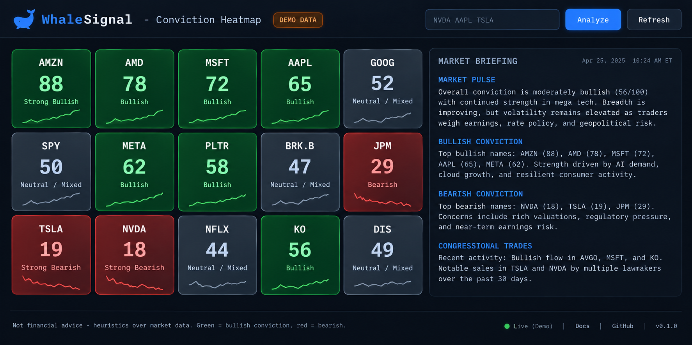

#  WhaleSignal MCP

**Turn raw Unusual Whales data into one decision-ready conviction score — spoken in plain English to any AI.**



*Conviction heatmap + live market briefing. (Design preview render; run `python -m whalesignal.web --demo` for the real thing.)* See the full terminal tour in [`docs/DEMO.md`](docs/DEMO.md).

Unusual Whales already ships a great hosted MCP that returns *raw* data. WhaleSignal goes one step further: it **fuses six proprietary datasets into a single explainable 0–100 conviction score** per ticker, so an LLM (or a human) gets an *answer*, not a spreadsheet.

Ask Claude / Cursor / ChatGPT: *"What's the conviction on NVDA?"* and get:

```
== NVDA  —  Strong Bullish  (BULLISH) ==
   [######################--------] 74.2/100   coverage 100%
   sub-signals:
     - options_flow_alerts   +0.81  w=0.30
     - net_premium           +0.66  w=0.28
     - options_volume        +0.40  w=0.14
     - dark_pool             +0.22  w=0.12
     - gamma_regime          +0.50  w=0.10
     - congress              +0.00  w=0.06 (no data)
   why:
     * options_flow_alerts: bullish (+0.81)
     * net_premium: bullish (+0.66)
     * gamma_regime: bullish (+0.50)
```

---

## Why it can win

- **It's an answer, not a dump.** Judges see instant, explainable signals — every score ships with a per-signal breakdown and a rationale. No black boxes.
- **Data fusion is the moat.** Options flow alerts + net premium + call/put volume + dark pool accumulation + dealer gamma regime + congressional trades, blended with tunable weights.
- **Graceful degradation.** Missing/permission-gated endpoints are dropped and weights renormalise — the score never silently lies.
- **Honest math.** Where directionality is ambiguous (dark pool without NBBO, gamma magnitude), we use conservative sign-only contributions instead of fake precision.
- **Uses real endpoints only.** Built straight off the official `skill.md` whitelist — zero hallucinated routes, correct `Authorization` + `UW-CLIENT-API-ID: 100001` headers, all GET.
- **Tested logic.** The scoring core is pure functions with a unit suite that runs with **no API key and no network**.

## The signals

| Sub-signal | Endpoint | What it measures |
|---|---|---|
| `options_flow_alerts` | `/api/option-trades/flow-alerts` | Aggressive call vs put whale premium |
| `net_premium` | `/api/stock/{t}/net-prem-ticks` | Cumulative net call vs net put premium |
| `options_volume` | `/api/stock/{t}/options-volume` | Call/put volume balance (P/C ratio) |
| `dark_pool` | `/api/darkpool/{t}` | Accumulation vs distribution off-exchange |
| `gamma_regime` | `/api/stock/{t}/spot-exposures/strike` | Dealer long/short gamma (stability) |
| `congress` | `/api/congress/recent-trades` | Recent congressional buys vs sells |

Weights live in `whalesignal/config.py` (`ConvictionWeights`) — tune to taste.

---

## Try it in 10 seconds (no API key)

WhaleSignal ships a **demo mode**: a deterministic synthetic data source with the exact
same interface as the live client, so the whole fetch -> fuse -> score pipeline runs
offline. Great for demos and CI; output is clearly stamped `** DEMO DATA **`.

```bash
cd ~/uw-challenge
python3 -m venv .venv && . .venv/bin/activate
pip install -r requirements.txt

python -m whalesignal.cli NVDA AAPL TSLA AMZN MSFT --demo
```

```
WhaleSignal ranking (5 tickers, best first):
 1. AMZN    87.9  Strong Bullish
 2. AMD     78.1  Strong Bullish
 ...
 5. NVDA    17.5  Strong Bearish
```

### One-call written market briefing

```bash
python -m whalesignal.cli --brief --demo            # default watchlist
python -m whalesignal.cli NVDA AMD AMZN --brief --demo
```

```
WhaleSignal Market Briefing - 2026-09-18  [DEMO DATA - synthetic, not live]
========================================================
Market pulse: RISK-ON / BULLISH. Net options premium $3.62M into calls vs $983.87K into puts.
Whales leaning bullish: AMZN (88), AMD (78), MSFT (78).
Whales leaning bearish: PLTR (25), TSLA (19), NVDA (18).
Top conviction: AMZN - Strong Bullish (87.9/100). options_flow_alerts: bullish (+1.00); net_premium: bullish (+1.00).
Congress desk: 19 buys vs 10 sells recently. Notable: Purchase NVDA ($250.00K); ...
```

### Web dashboard (conviction heatmap)

A zero-dependency (stdlib-only) single-page dashboard: a bullish/bearish heatmap of
your watchlist plus the live market briefing. Click any tile for its sub-signal
breakdown and rationale.

```bash
python -m whalesignal.web --demo          # then open http://127.0.0.1:8000
python -m whalesignal.web --port 8000     # live (needs UW_API_KEY)
```

Endpoints (reuse the same analysis code as the CLI + MCP server):
`GET /`, `GET /api/rank?tickers=...`, `GET /api/briefing?tickers=...`.

## Going live (with an API key)

```bash
cp .env.example .env
# edit .env and set UW_API_KEY=<your token>
python -m whalesignal.cli NVDA
python -m whalesignal.cli NVDA AAPL TSLA --rank --top 3
```

### Run the MCP server

```bash
python -m whalesignal.server                    # live (needs UW_API_KEY)
WHALESIGNAL_DEMO=1 python -m whalesignal.server  # demo data, no key needed
```

### Connect an MCP client (Claude Desktop / Cursor / VS Code)

Add to your MCP client config (adjust the absolute paths):

```json
{
  "mcpServers": {
    "whalesignal": {
      "command": "/data/data/com.termux/files/home/uw-challenge/.venv/bin/python",
      "args": ["-m", "whalesignal.server"],
      "env": { "UW_API_KEY": "your-uw-api-token" }
    }
  }
}
```

Then ask: *"Use whalesignal to rank my watchlist: NVDA, AMD, TSLA, PLTR."*

---

## MCP tools exposed

| Tool | Description |
|---|---|
| `conviction_score(ticker)` | Full fused 0–100 conviction with breakdown + rationale |
| `rank_watchlist(tickers, top?)` | Rank several tickers, highest conviction first |
| `market_briefing(tickers?, top?)` | One-call written daily brief: market pulse + ranked watchlist + notable congress trades |
| `flow_alerts(ticker, min_premium?, limit?)` | Raw unusual options flow alerts |
| `dark_pool(ticker, limit?)` | Recent dark pool prints |
| `market_pulse()` | Overall market sentiment from Market Tide |
| `congress_trades(ticker?, limit?)` | Recent congressional trades |

## Architecture (SOLID, tiny files)

```
whalesignal/
  config.py     # single source of truth: base URL, endpoints, weights
  client.py     # async UW API client (auth, retries, data unwrap) + client factory
  demo.py       # DemoClient: deterministic synthetic data, same interface as client
  signals.py    # PURE scoring math — no network, fully unit-tested
  analysis.py   # concurrent fetch + fuse (the I/O + logic seam)
  briefing.py   # market_briefing: pure summarizers + composer, async orchestrator
  server.py     # thin MCP adapter (works on mcp 1.x FastMCP and 2.x MCPServer)
  cli.py        # human-friendly terminal demo
  web.py        # stdlib-only dashboard server (heatmap + JSON endpoints)
  dashboard.html# single-page heatmap front-end (no build step, no CDN)
tests/
  test_signals.py        # pure scoring math (no key, no network)
  test_demo_pipeline.py  # full fetch->fuse pipeline via DemoClient
  test_briefing.py       # briefing summarizers + composer
  test_web.py            # web ticker parsing + asset presence
```

## Testing & linting

```bash
python tests/test_signals.py         # standalone, no deps, no key, no network
pytest -q                            # or, with pytest installed (20 tests)
ruff check whalesignal tests         # lint (config in pyproject.toml)
./scripts/demo.sh                    # full guided demo tour on synthetic data
```

20 tests: pure scoring math, full demo pipeline, briefing composer, and the web layer —
all runnable with no API key and no network.

## Disclaimer

WhaleSignal is an analytics tool, **not financial advice**. Signals are heuristics over
market data and can be wrong. Do your own research.
